## 6.程序测试

### 6.1测试环境

* 测试在visual studio 2017搭建的工程中进行

* 需要词法分析程序能够处理无词法错误的程序并输出记号序列

* 需要语法分析程序能够处理无语法错误的记号序列，并输出对应的产生式序列

### 6.2测试功能

* 有针对性地测试每一种成分的语义分析

* 编写包含各种语义错误的综合程序，进行最终测试，并检查语义分析遇到错误时的恢复情况

### 6.3测试情况

#### (1)词法分析

1. 非法标识符错误测试

   1. 测试用例

      ```pascal
      program testLex(input, output);
      var
      	25i, j, tmp, size: integer;
      	list:array[0..1000] of integer;
      begin
          for 25i := 1 to size-1 do
      	for j := 1 to i do
      	    if list[j] > list[j+1] then
      	    begin
      		    tmp := list[j];
      		    list[j] := list[j+1];
      		    list [j+1] := tmp;
      	    end;
      
          for 25i :=1 to size do
      	write(list[25i])
      end.
      ```

      

   2. 预期结果

      该错误类型为词法错误，对于代码中所定义的**"25i"** 词法会识别出错误，要求输出的报错信息中准确输出错误类型，发生错误的行号，错误内容，并停止程序的继续运行。

   3. 测试结果及分析

      

      

2. 注释错误测试

   1. 测试用例

      ```pascal
      program testLex(input, output);
      var
      	i, j, tmp, size: integer;
      	list:array[0..1000] of integer;
      	{wiwqkhjk62?P@!@@8}}}}
      begin
          for i := 1 to size-1 do
      	for j := 1 to i do
      	    if list[j] > list[j+1] then
      	    begin
      		    tmp := list[j];
      		    list[j] := list[j+1];
      		    list [j+1] := tmp;
      	    end;
      
          for i :=1 to size do
      	write(list[i])
      end.
      ```

      

   2. 预期结果

      该错误类型为词法错误，对于代码中出现的的注释 **{wiwqkhjk62?P@!@@8}}}}**词法会识别出错误，但并不将括号内的特殊字符识别为词法错误，而是将其与左右括号一起识别为注释，真正的错误应该是最后三个无对应匹配左括号的右括号，因此要求输出的报错信息中准确输出错误类型为词法错误，发生错误的行号，错误内容为**}}}**，并停止程序的继续运行。

   3. 测试结果及分析

      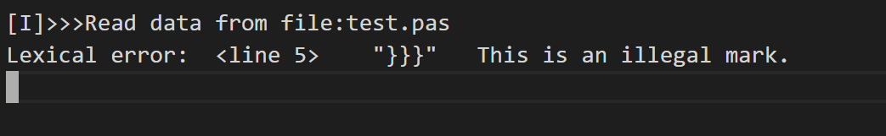

3. 非法符号错误测试

   1. 测试用例

      ```pascal
      program testLex(input, output);
      var
      	i@djdhs, j, tmp, size: integer;
      	list:array[0..1000] of integer;	
      begin
          for i@djdhs := 1 to size-1 do
      	for j := 1 to i@djdhs do
      	    if list[j] > list[j+1] then
      	    begin
      		    tmp := list[j];
      		    list[j] := list[j+1];
      		    list [j+1] := tmp;
      	    end;
      
          for i@djdhs :=1 to size do
      	write(list[i@djdhs])
      end.
      ```

   2. 预期结果

      该错误类型为词法错误，对于代码中所定义的**"i@djdhs"** 词法会识别出非法符号**@**，要求输出的报错信息中准确输出错误类型，发生错误的行号，错误内容，并停止程序的继续运行。

   3. 测试结果及分析

      对于非法符号，为了避免繁杂只给出了对**@**的测试，但实际上词法对错误符号的识别支持@、#、¥、！、+、*等
      
      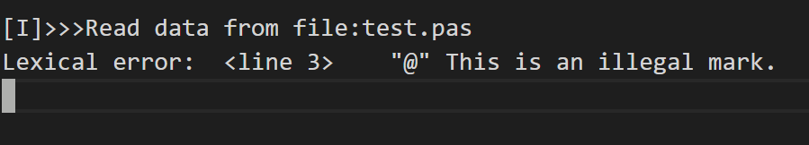

4. 字符长度超标错误测试

   1. 测试用例

      ```pascal
      program testLex(input, output);
      var
      	i, j, tmp, size: integer;
      	list:array[0..1000] of integer;	
      	dgqwyudqkjdbuywqeihlqwjdhskdbwjbkduowqhlwddwwegdehkkhwkdgwljdlwjdew: integer;
      begin
          for i := 1 to size-1 do
      	for j := 1 to i do
      	    if list[j] > list[j+1] then
      	    begin
      		    tmp := list[j];
      		    list[j] := list[j+1];
      		    list [j+1] := tmp;
      	    end;
      
          for i :=1 to size do
      	write(list[i])
      end.
      ```

   2.  预期结果

      该错误类型为词法错误，由于设定的pascal语言对于标识符和数字的长度最大长度为32位，对于代码中出现的**dgqwyudqkjdbuywqeihlqwjdhskdbwjbkduowqhlwddwwegdehkkhwkdgwljdlwjdew**，长度超过了32位，故会识别出词法错误，要求输出的报错信息中准确输出错误类型，发生错误的行号，错误内容，并停止程序的继续运行。

   3. 测试结果及分析

      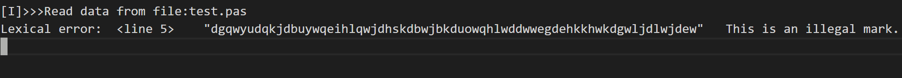

5. 字符符号内为字符串错误测试

   1.  测试用例

      1. ```pascal
         program testLex(input, output);
         const 	
         	ch = 'hwqywu';
         var
         	i, j, tmp, size: integer;
         	list:array[0..1000] of integer;
         
         begin
             for i := 1 to size-1 do
         	for j := 1 to i do
         	    if list[j] > list[j+1] then
         	    begin
         		    tmp := list[j];
         		    list[j] := list[j+1];
         		    list [j+1] := tmp;
         	    end;
         
             for i :=1 to size do
         	write(list[I]);
         end.
         ```

   2. 预期结果

      该错误类型为词法错误，对于代码中出现的**'hwqywu'**，两个单引号内出现了长度超过1的字符串，故会识别出词法错误，要求输出的报错信息中准确输出错误类型，发生错误的行号，错误内容，并停止程序的继续运行。

   3. 测试结果及分析
   
      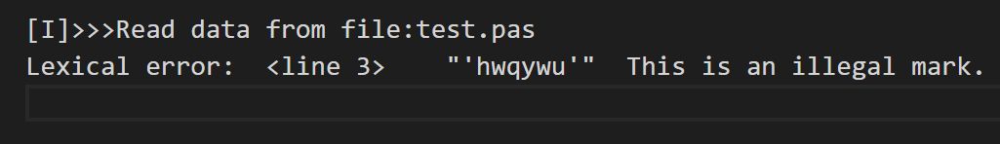
   
      

#### (2)语法分析

1. 括号不匹配

   1. 测试用例

      ```pascal
      program testLex(input, output;
      var
      	i, j, tmp, size: integer;
      	list:array[0..1000] of integer;
      begin
          for i := 1 to size-1 do
      	for j := 1 to i do
      	    if list[j] > list[j+1] then
      	    begin
      		    tmp := list[j];
      		    list[j] := list[j+1];
      		    list [j+1] := tmp;
      	    end;
      
          for i :=1 to size do
      	write(list[i])
      end.
      ```

      

   2. 预期结果

      上述代码的词法分析结果正常，但在第一行出现了括号未匹配的问题 **(input, output;**，由语法分析部分报错，要求输出结果声明为语法分析，并给出错误行号为**1**，输出预测的错误内容。

   3. 测试结果及分析

      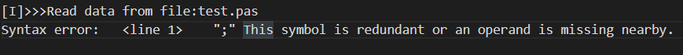

2. 操作数缺失

   1. 测试用例

      ```pascal
      program testLex(input, output);
      var
      	i, j, tmp, size: integer;
      	list:array[0..1000] of integer;
      begin
          for i := to size-1 do
      	for j := 1 to i do
      	    if list[j] > list[j+1] then
      	    begin
      		    tmp := list[j];
      		    list[j] := list[j+1];
      		    list [j+1] := tmp;
      	    end;
      
          for i :=1 to size do
      	write(list[i])
      end.
      ```

      

   2. 预期结果

      上述代码在第六行本应是**for i := 1 to size-1 do**，但实际却缺少了操作数1，但语法分析并不能准确识别这里属于操作数缺失，而只能识别出这里出现了错误，故在报错信息中会给出错误类别为**语法错误**，给出错误行号，并给出识别到错误时当前识别到的字符以及预测该错误具体可能是什么，但未必准确。

   3. 测试结果及分析

      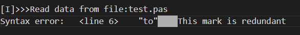

3. 符号冗余

   1. 测试用例

      ```pascal
      program testLex(input, output);
      var
      	i,, j, tmp, size: integer;
      	list:array[0..1000] of integer;
      begin
          for i := 1 to size-1 do
      	for j := 1 to i do
      	    if list[j] > list[j+1] then
      	    begin
      		    tmp := list[j];
      		    list[j] := list[j+1];
      		    list [j+1] := tmp;
      	    end;
      
          for i :=1 to size do
      	write(list[i])
      end.
      ```

      

   2. 预期结果

      该测试样例在词法上没有问题，但在语法分析时会发现第三行出现了重复的两个**","**，语法分析会识别出该错误，并报告语法分析异常，给出出错行号为**3**，错误类型为符号冗余，并停止程序的继续执行。

   3. 测试结果及分析

      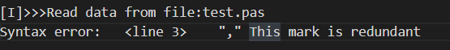

      

4. 符号缺失

   1. 测试用例

      ```pascal
      program testLex(input, output);
      var
      	i, j, tmp, size: integer
      	list:array[0..1000] of integer;
      begin
          for i := 1 to size-1 do
      	for j := 1 to i do
      	    if list[j] > list[j+1] then
      	    begin
      		    tmp := list[j];
      		    list[j] := list[j+1];
      		    list [j+1] := tmp;
      	    end;
      
          for i :=1 to size do
      	write(list[i])
      end.
      ```

      

   2. 预期结果

      在**第3行**缺少了结束的**;**，语法分析报错，输出错误类型语法错误，错误行号3，错误内容为符号缺失。

   3. 测试结果及分析

      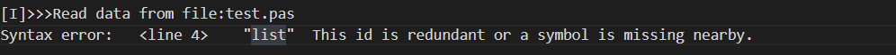

      在实际测试时，发现错误行号输出并不是**3，而是4**，因为在语法分析的错误分析时，并不能完全准确的识别出错误的发生地点，而只能给出发生了语法错误时正在识别的那个符号的位置，在发生**“;”**缺失的那一行当时语法分析并没有立即识别出错误，而在下一行才开始发现发生了语法错误，所以发生了错误报错行号与实际错误行号不一致的情况。

#### (3)语义分析	


1. 常量重复定义

    测试用例：
    ```pascal
    program test;
    const
        a=1;
        a=1.0;
    begin
    end.
    ```
    
    预期结果:
    
    **'a=1.0'**处报告重复定义错误。
    
    测试结果：
    
    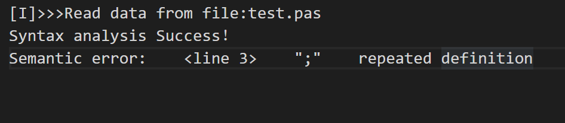

  2. 变量重复定义

  测试用例:

  ```pascal
  program test;
  var
  	a:integer;
  	a:real;
  begin
  	
  end.
  ```

  预期结果:

  **'a:real'**处报告重复定义错误;

  测试结果:

  

  

  3. 常量被赋值

  测试用例:

  ```pascal
  
  program a;
  var
      b:integer;
  procedure gcd(var a:integer);
  const
      b=1;
  begin
      b:=a;
  end;
  begin
      gcd(b);
  end.
  
  ```

预期结果：

**'b:=a'**处报错。

测试结果：

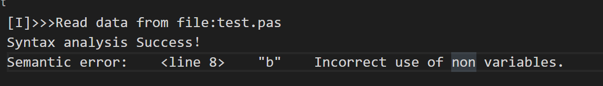

4.使用未定义的常量

测试用例:

```pascal
program test(input,output);   
begin
	a:=1;
end.
```

预期结果:

**'a:=1'**处报错

测试结果:

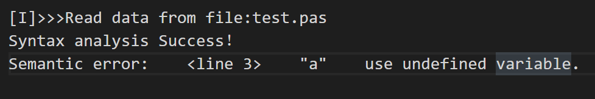


5 if中判断条件的类型错误

测试用例：

```pascal
program test(input,output);
var a,b:integer;  
    c:boolean;  
    d:real;  
    e:char;  
begin  
    a:=1;   
    if d then  
        begin  
            a:=a+1;  
        end  
    else  
        begin  
            a:=a+10;    
        end;
end. 
```

预期结果：

**'if c then'**处报错

测试结果:

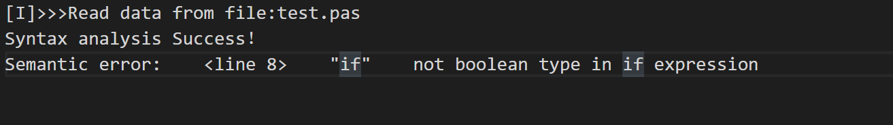


6. for中循环变量类型错误

   测试用例：

   ```c++
   program test(input,output);  
   var a,b:integer;  
       c:char;  
   begin  
   for a:=6 to 1+3 do  //正确
       write(b);  
   for a:=c to a+b do //start表达式不是integer类型  
       write(a);  
   end. 
   ```

   预期结果：

   **'a:=c'**处报错

   测试结果：

   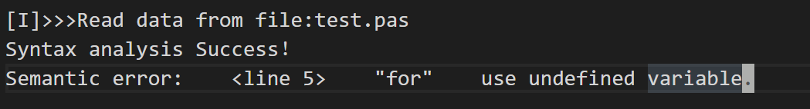

   7. 数组定义上限小于下限

   测试样例：

   ```pascal
   program test(input,output);  
   var b:array[5..10] of integer;
       a:array[10..5] of integer;
   begin  
     
   end.  
   ```

   预期结果:

   **'10..5'**处报错

   测试结果:

   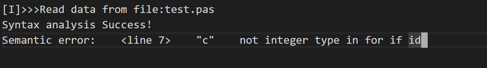

   

   8. 数组使用类型不是int

      测试样例：

      ```pascal
      program test(input,output);  
      const e=10;  
            f=20;  
      var a: array[0..5,6..10,11..15] of integer;  
          b,c: integer;  
          d: char;  
      begin  
          a[d,b>c,b+c]:=b; 
      end. 
      ```

      预期结果:

      **'b>c'**处报错

      测试结果:

      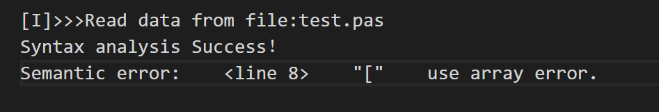

   9. 数组使用维数错误

   测试样例：

   ```pascal
   program test(input,output);  
   var a: array[0..5,6..10,11..15] of integer;  
       b: integer;  
   begin  
       a[0]:=b;  
       b:=a[0, 6];  
       a[0, 6, 11]:=b;  
       b:=a[0, 6, 11, 16];  
   end.  
   ```

   预期结果:

   **’a[0]:=6'**处报错

   测试结果:

   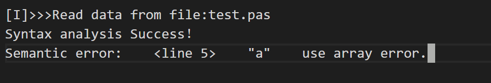

   10.  函数未定义使用错误

   测试样例：

   ```pascal
   program test(input,output);  
   const f=5;  
   var a,b:integer;  
       c:array[1..5] of integer;    
   begin  
       a:=fun(1);
   end.
   ```

   预期结果:

   **'fun(1)'**处报错

   测试结果:

   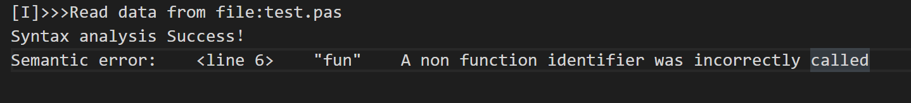

   11.函数调用参数类型错误

   测试样例:

   ```pascal
   program test(input,output);  
   const h=5;  
   var d:array[1..5] of integer;  
       e,f,g:integer; 
   	m:char; 
   procedure pro(var a,b,c:integer);
   begin  
       if a<=b then  
           if b<=c then  
               write(1)   
   end;  
   begin 
       pro(d[1],d[2],d[3]);
   	pro(m,e,f);
   end. 
   ```

   

   预期结果:

   **'pro(m,e,f)'**处报错

   测试结果:

   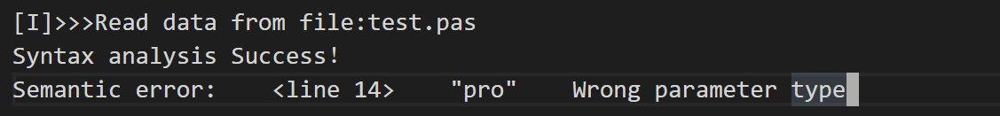

   12.函数参数数量错误

   测试用例:

```pascal
program test(input,output);  
const h=5;  
var d:array[1..5] of integer;  
    e,f,g:integer; 
	m:char; 
procedure pro(var a,b,c,d:integer);
begin  
    if a<=b then  
        if b<=c then  
            write(1)   
end;  
begin 
    pro(d[1],d[2],d[3]);
end. 
```

预期结果：

**'pro(d[1],d[2],d[3])'**处报错

测试结果:

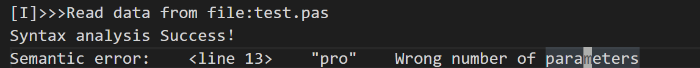

13.引用参数调用时使用非单个变量

测试用例：

```pascal

program a;
var
    b:integer;
function gcd(var a:integer):integer;
begin
    if a=0 then gcd:=1
    else gcd:=a*gcd(a);
end;
begin
    gcd(b-1);
end.

```

预期结果：

**'gcd(b-1)'**处报错

测试结果：

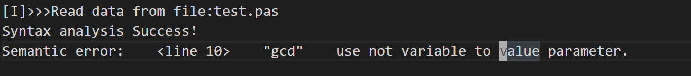

## 代码生成测试

1. 基础功能测试

测试样例

```pascal
program a;
const 
    maxN=200005;
    a=123.0;
    c='a';
    d=-1325;
    e=+3253;
var
    f,g,k,b:integer;
      h,i:char;
    dfds,c2,g3:boolean;
    dfsge1312,d13,reww:real;
 begin
    d13:=(g+f)*k / b;
	c2:=h>i;
	reww:=(dfsge1312+reww)-k+b mod (f+g)
    
 end.
```

测试结果：

```c
#include <stdio.h>

const short maxn = 200005;
const float a = 123.0;
const char c = 'a';
const short d = -1325;
const short e = +3253;
short f, g, k, b;
char h, i;
bool dfds, c2, g3;
float dfsge1312, d13, reww;
int main()
{
    d13 = (g + f) * k / (float)b;
    c2 = h > i;
    reww = (dfsge1312 + reww) - k + b % (f + g);
    return 0;
}
```

2. 数组测试

测试样例：

本样例主要测试的是能否将数组做出正确的处理，

由于C语言与pascal语言对于数组定义的不同，转换时需要减去下标

```pascal
program a;
var 
    c :array [105..1000] of integer;
    d :array [34..500,78..897] of integer;
 function gcd(a,b:integer):integer;
 var
    c :array [105..1000,73..100] of integer;
     e :array [105..1000] of integer;
     f :array [34..500,78..897] of integer;
        begin 
         read(e[768]);
        write(f[54,97]);
        read(c[768,79]);
        write(d[54,97]);
        if b=0 then gcd:=a
        else gcd:=gcd(b, a mod b)
        end;
 begin
    write(c[d[32,47]],d[45,79]);
 end.
```

测试结果：

```c++
#include <stdio.h>

short c[896];
short d[467][820];
short gcd(short a, short b)
{
    short gcd_returnVal;
    short c[896][28];
    short e[896];
    short f[467][820];
    scanf("%hd", &e[768 - 105]);
    printf("%hd", f[54 - 34][97 - 78]);
    scanf("%hd", &c[768 - 105][79 - 73]);
    printf("%hd", d[54 - 34][97 - 78]);
    if (b == 0)
        gcd_returnVal = a;
    else
        gcd_returnVal = gcd(b, a % b);
    return gcd_returnVal;
}
int main()
{
    printf("%hd %hd", c[d[32 - 34][47 - 78] - 105], d[45 - 34][79 - 78]);
    return 0;
}

```

3. 递归测试:

测试样例：

该样例主要目的为测试是否能够正确应对函数递归的情况，

代码的含义为计算两个数的最大公约数

```pascal
program example(input,output);
    var x,y:integer;
    function gcd(a,b:integer):integer;
    var d:integer;
        begin 
            if b=0 then gcd:=a
            else gcd:=b;
            gcd:=1;
            d:=gcd;
        end;
    begin
        read(x, y);
        write(gcd(x, y))
    end.
```


测试结果：

```C
#include <stdio.h>

short x, y;
short gcd(short a, short b)
{
    short gcd_returnVal;
    short d;
    if (b == 0)
        gcd_returnVal = a;
    else
        gcd_returnVal = b;
    gcd_returnVal = 1;
    d = gcd_returnVal;
    return gcd_returnVal;
}
int main()
{
    scanf("%hd %hd", &x, &y);
    printf("%hd", gcd(x, y));
    return 0;
}

```

4. 快排测试

测试样例：

该样例为快速排序算法

```pascal
program qsort(input,output);
var
	n,i:integer;
	list:array[0..1000] of integer;
	c:char;
procedure qsort(low, high:integer);
var
	l,h,m:integer;
	i,j:integer;
	temp:integer;
	flag:integer;
begin
	flag:=0;
	l:=low; h:=high;
	m:=list[(l+h) div 2];
	for i:=1 to 1000 do
	begin
	if flag=0 then begin
		for j:=1 to 1000 do
			if list[l]<m then l:=l+1;
		for j:=1 to 1000 do
			if list[h]>m then h:=h-1;
		if l<=h then
		begin
			temp:=list[l]; list[l]:=list[h]; list[h]:=temp;
			l:=l+1; h:=h-1;
		end;
		if (l>h) then flag:=1;
	end;
	end;
	if l<high then qsort(l,high);
	if h>low then qsort(low,h);
end;

begin
	read(n);
	for i:=0 to n-1 do
		read(list[i]);
	qsort(0,n-1);
        for i:=0 to n-1 do
        begin
            write(list[i]);
        end
end.

```

测试结果:

```c
#include <stdio.h>

short n, i;
short list[1001];
char c;
void qsort(short low, short high)
{
    short l, h, m;
    short i, j;
    short temp;
    short flag;
    flag = 0;
    l = low;
    h = high;
    m = list[(l + h) / 2 - 0];
    for (i = 1; i <= 1000; i++)
    {
        if (flag == 0)
        {
            for (j = 1; j <= 1000; j++)
                if (list[l - 0] < m)
                    l = l + 1;
            for (j = 1; j <= 1000; j++)
                if (list[h - 0] > m)
                    h = h - 1;
            if (l <= h)
            {
                temp = list[l - 0];
                list[l - 0] = list[h - 0];
                list[h - 0] = temp;
                l = l + 1;
                h = h - 1;
            }
            if ((l > h))
                flag = 1;
        }
    }
    if (l < high)
        qsort(l, high);
    if (h > low)
        qsort(low, h);
}
int main()
{
    scanf("%hd", &n);
    for (i = 0; i <= n - 1; i++)
        scanf("%hd", &list[i - 0]);
    qsort(0, n - 1);
    for (i = 0; i <= n - 1; i++)
        printf("%hd", list[i - 0]);
    return 0;
}

```

5. 额外题目测试

   该样例引用的是一下网址的题目的解题代码

   > https://codeforces.ml/contest/1515/problem/D

```pascal
program a;
const 
    maxN=200005;
var
    cntL,cntR:array [0..200005] of integer;
    T,n,l,r,c:integer;
    o,i:integer;
    zd,zs,yd,ys:integer;
    ans:integer;
procedure swap(var a,b:integer);
var
    t:integer;
begin
    t:=a;
    a:=b;
    b:=t;
end;
 begin
    read(T);
    for o:=1 to T do begin
        read(n,l,r);
        for i:=1 to n do begin
            cntL[i]:=0;
            cntR[i]:=0;
        end;
        for i:=1 to l do begin
            read(c);
            cntL[c]:=cntL[c]+1;
        end;
        for i:=1 to r do begin
            read(c);
            cntR[c]:=cntR[c]+1;
        end;
        zd:=0;
        zs:=0;
        yd:=0;
        ys:=0;
        for i:=1 to n do begin
            zd:=zd+cntL[i] mod 2;
            zs:=zs+cntL[i] div 2;
        end;
        for i:=1 to n do begin
            yd:=yd+cntR[i] mod 2;
            ys:=ys+cntR[i] div 2;
        end;
        ans:=0;
        if zd<yd then begin
            swap(zd,yd);
            swap(zs,ys);
        end;
        zd:=zd-yd;
        ans:=ans+yd+zs;
        yd:=0;
        zs:=0;
        if ys*2>=zd then begin
            ans:=ans+zd+(ys*2-zd)div 2;
        end
        else begin
            ans:=ans+ys*2;
            zd:=zd-ys*2;
            ans:=ans+2;
        end;
        write(ans);
    end;

 end.
```

测试结果：

```c++
#include <stdio.h>

const short maxn = 200005;
short cntl[200006];
short cntr[200006];
short t, n, l, r, c;
short o, i;
short zd, zs, yd, ys;
short ans;
void swap(short &a, short &b)
{
    short t;
    t = a;
    a = b;
    b = t;
}
int main()
{
    scanf("%hd", &t);
    for (o = 1; o <= t; o++)
    {
        scanf("%hd %hd %hd", &n, &l, &r);
        for (i = 1; i <= n; i++)
        {
            cntl[i - 0] = 0;
            cntr[i - 0] = 0;
        }
        for (i = 1; i <= l; i++)
        {
            scanf("%hd", &c);
            cntl[c - 0] = cntl[c - 0] + 1;
        }
        for (i = 1; i <= r; i++)
        {
            scanf("%hd", &c);
            cntr[c - 0] = cntr[c - 0] + 1;
        }
        zd = 0;
        zs = 0;
        yd = 0;
        ys = 0;
        for (i = 1; i <= n; i++)
        {
            zd = zd + cntl[i - 0] % 2;
            zs = zs + cntl[i - 0] / 2;
        }
        for (i = 1; i <= n; i++)
        {
            yd = yd + cntr[i - 0] % 2;
            ys = ys + cntr[i - 0] / 2;
        }
        ans = 0;
        if (zd < yd)
        {
            swap(zd, yd);
            swap(zs, ys);
        }
        zd = zd - yd;
        ans = ans + yd + zs;
        yd = 0;
        zs = 0;
        if (ys * 2 >= zd)
            ans = ans + zd + (ys * 2 - zd) / 2;
        else
        {
            ans = ans + ys * 2;
            zd = zd - ys * 2;
            ans = ans + 2;
        }
        printf("%hd", ans);
    }
    return 0;
}

```

