## 6.程序测试

### 6.1测试环境

* 测试在visual studio 2017搭建的工程中进行

* 需要词法分析程序能够处理无词法错误的程序并输出记号序列

* 需要语法分析程序能够处理无语法错误的记号序列，并输出对应的产生式序列

### 6.2测试功能

* 有针对性地测试每一种成分的语义分析

* 编写包含各种语义错误的综合程序，进行最终测试，并检查语义分析遇到错误时的恢复情况

### 6.3测试情况

#### (1)词法分析

1. 非法标识符错误测试

   1. 测试用例

      ```pascal
      program testLex(input, output);
      var
      	25i, j, tmp, size: integer;
      	list:array[0..1000] of integer;
      begin
          for 25i := 1 to size-1 do
      	for j := 1 to i do
      	    if list[j] > list[j+1] then
      	    begin
      		    tmp := list[j];
      		    list[j] := list[j+1];
      		    list [j+1] := tmp;
      	    end;
      
          for 25i :=1 to size do
      	write(list[25i])
      end.
      ```

      

   2. 预期结果

      该错误类型为词法错误，对于代码中所定义的**"25i"** 词法会识别出错误，要求输出的报错信息中准确输出错误类型，发生错误的行号，错误内容，并停止程序的继续运行。

   3. 测试结果及分析

      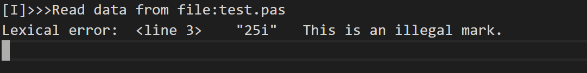

      

2. 注释错误测试

   1. 测试用例

      ```pascal
      program testLex(input, output);
      var
      	i, j, tmp, size: integer;
      	list:array[0..1000] of integer;
      	{wiwqkhjk62?P@!@@8}}}}
      begin
          for i := 1 to size-1 do
      	for j := 1 to i do
      	    if list[j] > list[j+1] then
      	    begin
      		    tmp := list[j];
      		    list[j] := list[j+1];
      		    list [j+1] := tmp;
      	    end;
      
          for i :=1 to size do
      	write(list[i])
      end.
      ```

      

   2. 预期结果

      该错误类型为词法错误，对于代码中出现的的注释 **{wiwqkhjk62?P@!@@8}}}}**词法会识别出错误，但并不将括号内的特殊字符识别为词法错误，而是将其与左右括号一起识别为注释，真正的错误应该是最后三个无对应匹配左括号的右括号，因此要求输出的报错信息中准确输出错误类型为词法错误，发生错误的行号，错误内容为**}}}**，并停止程序的继续运行。

   3. 测试结果及分析

      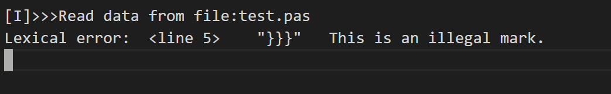

3. 非法符号错误测试

   1. 测试用例

      ```pascal
      program testLex(input, output);
      var
      	i@djdhs, j, tmp, size: integer;
      	list:array[0..1000] of integer;	
      begin
          for i@djdhs := 1 to size-1 do
      	for j := 1 to i@djdhs do
      	    if list[j] > list[j+1] then
      	    begin
      		    tmp := list[j];
      		    list[j] := list[j+1];
      		    list [j+1] := tmp;
      	    end;
      
          for i@djdhs :=1 to size do
      	write(list[i@djdhs])
      end.
      ```

   2. 预期结果

      该错误类型为词法错误，对于代码中所定义的**"i@djdhs"** 词法会识别出非法符号**@**，要求输出的报错信息中准确输出错误类型，发生错误的行号，错误内容，并停止程序的继续运行。

   3. 测试结果及分析

      对于非法符号，为了避免繁杂只给出了对**@**的测试，但实际上词法对错误符号的识别支持@、#、¥、！、+、*等
      
      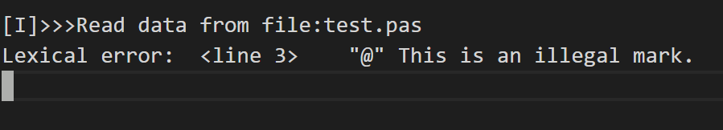

4. 字符长度超标错误测试

   1. 测试用例

      ```pascal
      program testLex(input, output);
      var
      	i, j, tmp, size: integer;
      	list:array[0..1000] of integer;	
      	dgqwyudqkjdbuywqeihlqwjdhskdbwjbkduowqhlwddwwegdehkkhwkdgwljdlwjdew: integer;
      begin
          for i := 1 to size-1 do
      	for j := 1 to i do
      	    if list[j] > list[j+1] then
      	    begin
      		    tmp := list[j];
      		    list[j] := list[j+1];
      		    list [j+1] := tmp;
      	    end;
      
          for i :=1 to size do
      	write(list[i])
      end.
      ```

   2.  预期结果

      该错误类型为词法错误，由于设定的pascal语言对于标识符和数字的长度最大长度为32位，对于代码中出现的**dgqwyudqkjdbuywqeihlqwjdhskdbwjbkduowqhlwddwwegdehkkhwkdgwljdlwjdew**，长度超过了32位，故会识别出词法错误，要求输出的报错信息中准确输出错误类型，发生错误的行号，错误内容，并停止程序的继续运行。

   3. 测试结果及分析

      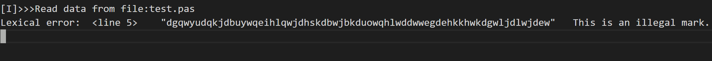

5. 字符符号内为字符串错误测试

   1.  测试用例

      1. ```pascal
         program testLex(input, output);
         const 	
         	ch = 'hwqywu';
         var
         	i, j, tmp, size: integer;
         	list:array[0..1000] of integer;
         
         begin
             for i := 1 to size-1 do
         	for j := 1 to i do
         	    if list[j] > list[j+1] then
         	    begin
         		    tmp := list[j];
         		    list[j] := list[j+1];
         		    list [j+1] := tmp;
         	    end;
         
             for i :=1 to size do
         	write(list[I]);
         end.
         ```

   2. 预期结果

      该错误类型为词法错误，对于代码中出现的**'hwqywu'**，两个单引号内出现了长度超过1的字符串，故会识别出词法错误，要求输出的报错信息中准确输出错误类型，发生错误的行号，错误内容，并停止程序的继续运行。

   3. 测试结果及分析
   
      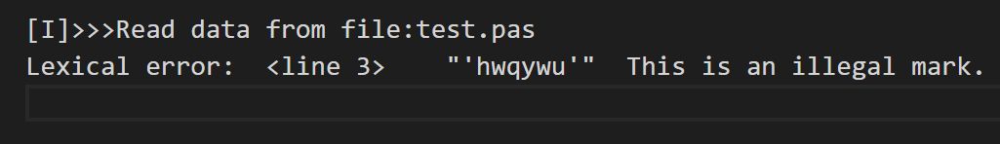
   
      

#### (2)语法分析

#### (3)语义分析	


1. 常量重复定义

    测试用例：
    ```pascal
    program test;
    const
        a=1;
        a=1.0;
    begin
    end.
    ```
    
    预期结果:
    
    **'a=1.0'**处报告重复定义错误。
    
    测试结果：
    
    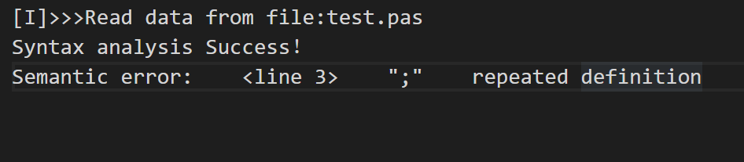

  2. 变量重复定义

  测试用例:

  ```pascal
  program test;
  var
  	a:integer;
  	a:real;
  begin
  	
  end.
  ```

  预期结果:

  **'a:real'**处报告重复定义错误;

  测试结果:

  

  

  3. 常量被赋值

  测试用例:

  ```pascal
  
  program a;
  var
      b:integer;
  procedure gcd(var a:integer);
  const
      b=1;
  begin
      b:=a;
  end;
  begin
      gcd(b);
  end.
  
  ```

预期结果：

**'b:=a'**处报错。

测试结果：

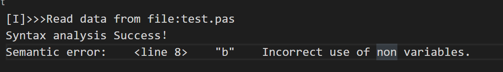

4.使用未定义的常量

测试用例:

```pascal
program test(input,output);   
begin
	a:=1;
end.
```

预期结果:

**'a:=1'**处报错

测试结果:

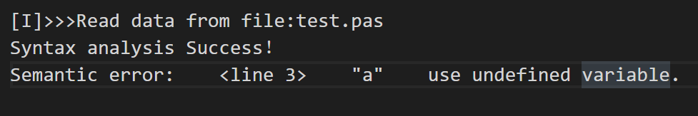


5 if中判断条件的类型错误

测试用例：

```pascal
program test(input,output);
var a,b:integer;  
    c:boolean;  
    d:real;  
    e:char;  
begin  
    a:=1;   
    if d then  
        begin  
            a:=a+1;  
        end  
    else  
        begin  
            a:=a+10;    
        end;
end. 
```

预期结果：

**'if c then'**处报错

测试结果:

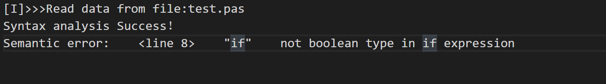


6. for中循环变量类型错误

   测试用例：

   ```c++
   program test(input,output);  
   var a,b:integer;  
       c:char;  
   begin  
   for a:=6 to 1+3 do  //正确
       write(b);  
   for a:=c to a+b do //start表达式不是integer类型  
       write(a);  
   end. 
   ```

   预期结果：

   **'a:=c'**处报错

   测试结果：

   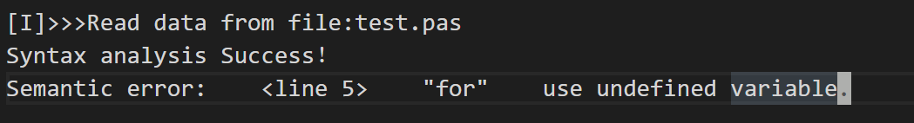

   7. 数组定义上限小于下限

   测试样例：

   ```pascal
   program test(input,output);  
   var b:array[5..10] of integer;
       a:array[10..5] of integer;
   begin  
     
   end.  
   ```

   预期结果:

   **'10..5'**处报错

   测试结果:

   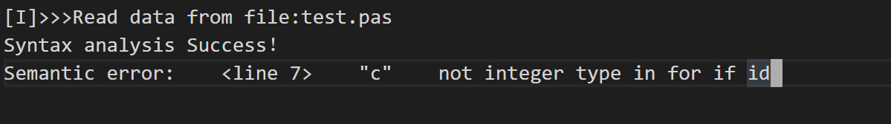

   

   8. 数组使用类型不是int

      测试样例：

      ```pascal
      program test(input,output);  
      const e=10;  
            f=20;  
      var a: array[0..5,6..10,11..15] of integer;  
          b,c: integer;  
          d: char;  
      begin  
          a[d,b>c,b+c]:=b; 
      end. 
      ```

      预期结果:

      **'b>c'**处报错

      测试结果:

      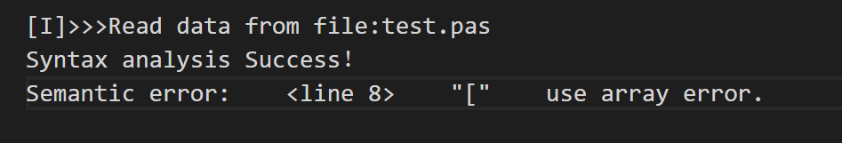

   9. 数组使用维数错误

   测试样例：

   ```pascal
   program test(input,output);  
   var a: array[0..5,6..10,11..15] of integer;  
       b: integer;  
   begin  
       a[0]:=b;  
       b:=a[0, 6];  
       a[0, 6, 11]:=b;  
       b:=a[0, 6, 11, 16];  
   end.  
   ```

   预期结果:

   **’a[0]:=6'**处报错

   测试结果:

   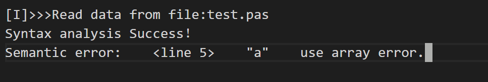

   10.  函数未定义使用错误

   测试样例：

   ```pascal
   program test(input,output);  
   const f=5;  
   var a,b:integer;  
       c:array[1..5] of integer;    
   begin  
       a:=fun(1);
   end.
   ```

   预期结果:

   **'fun(1)'**处报错

   测试结果:

   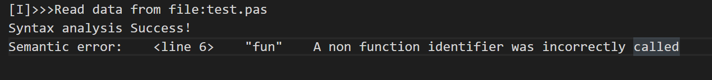

   11.函数调用参数类型错误

   测试样例:

   ```pascal
   program test(input,output);  
   const h=5;  
   var d:array[1..5] of integer;  
       e,f,g:integer; 
   	m:char; 
   procedure pro(var a,b,c:integer);
   begin  
       if a<=b then  
           if b<=c then  
               write(1)   
   end;  
   begin 
       pro(d[1],d[2],d[3]);
   	pro(m,e,f);
   end. 
   ```

   

   预期结果:

   **'pro(m,e,f)'**处报错

   测试结果:

   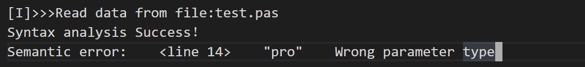

   12.函数参数数量错误

   测试用例:

```pascal
program test(input,output);  
const h=5;  
var d:array[1..5] of integer;  
    e,f,g:integer; 
	m:char; 
procedure pro(var a,b,c,d:integer);
begin  
    if a<=b then  
        if b<=c then  
            write(1)   
end;  
begin 
    pro(d[1],d[2],d[3]);
end. 
```

预期结果：

**'pro(d[1],d[2],d[3])'**处报错

测试结果:

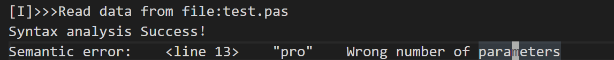

13.引用参数调用时使用非单个变量

测试用例：

```pascal

program a;
var
    b:integer;
function gcd(var a:integer):integer;
begin
    if a=0 then gcd:=1
    else gcd:=a*gcd(a);
end;
begin
    gcd(b-1);
end.

```

预期结果：

**'gcd(b-1)'**处报错

测试结果：

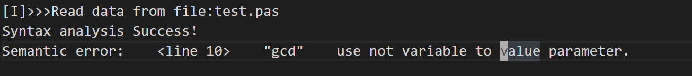

